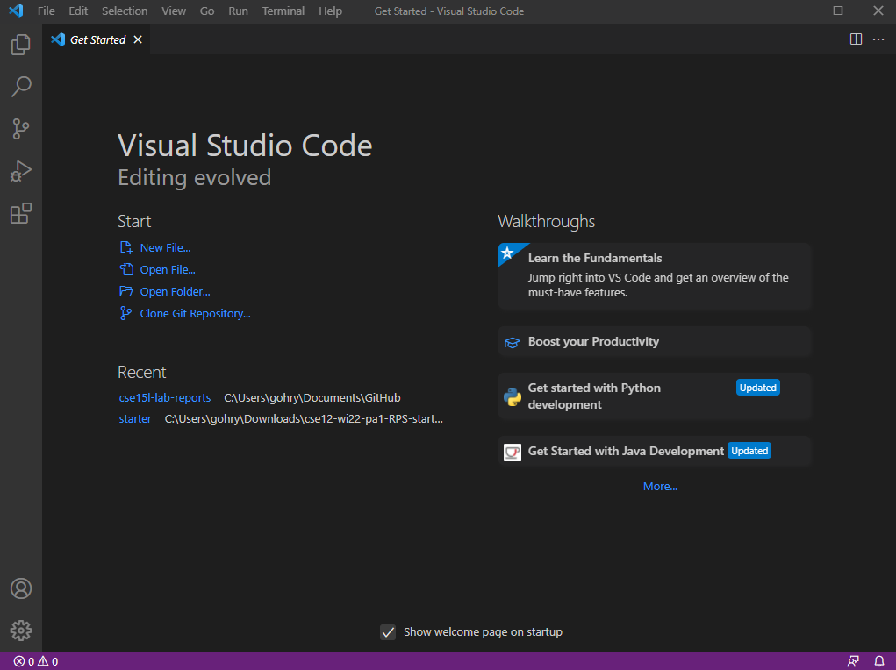

# Week 2 Lab Report
## This report includes the steps I took to complete the week 1 lab

1. The first step is to download VsCode if it is not already installed. I will demonstrate the setup for VsCode for Windows.

* Download VsCode using this [link](https://code.visualstudio.com/download)

* Once VsCode has been downloaded, open up the program. You should see a window like this 

