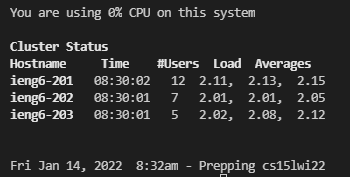

# Week 2 Lab Report
## This report includes the steps I took to complete the week 1 lab. All of these steps will be the steps required for Windows users.

### 1. Setting up VsCode

* Download VsCode using this [link](https://code.visualstudio.com/download)

* Once VsCode has been downloaded, open up the program. You should see a window like this 

* Click on the extensions tab on the left side of the window. It is the image on the bottom with the foru squares.

* Search "java" in the search bar and install the "Extension Pack for Java" and "Debugger for Java" if they are not already installed. You may also install any other extensions that you would find useful.

* Now that VsCode has been setup, we can move onto connecting through ssh.

### 2. SSH

* Install OpenSSH following the instructions at this [link](https://docs.microsoft.com/en-us/windows-server/administration/openssh/openssh_install_firstuse#install-openssh-using-windows-settings)

* Next we will have to look up our CSE15L account at this [link](https://sdacs.ucsd.edu/~icc/index.php)

* Fill in your username and Student ID in the first two options and click submit.

* Click on the account beginning with cs15l

* You will have to change your password for this account. Many students (including me) had issues with this step. One tip that worked for me was to select the yes option in the "*Change MyTritonLink password*". It will likely take a while before you password is actually updated, so wait around 15 mins before moving onto the next step.

* Once you have succefully changed your password, open up VsCode and click on *Terminal* in the top bar.

* Click on *New Terminal*

* In the terminal type in the following command filling in your unique account but including the @ and everything after.
`ssh UniqueAccount@ieng6.ucsd.edu`

* You may or may not get a warning message when you first try this command. Type `yes`.

* The terminal will ask for your password. Your password will not show as you type. Enter your password, and if your connection was successful you will see something like this.

* You are now connected to the remote server. If the terminal asks for your password again after you pressed enter, this means that you passsword was incorrect. Mkae sure you are typing your password correctly. 

* If you are sure that you have typed your password in correctly, you should either try again later to see if your password change had not gone through yet or reset your password again.
