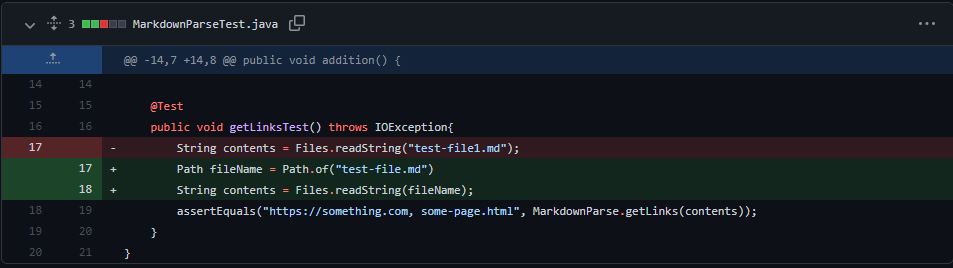
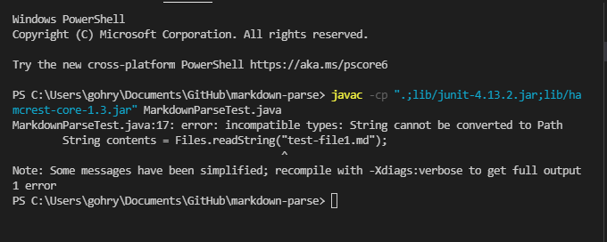
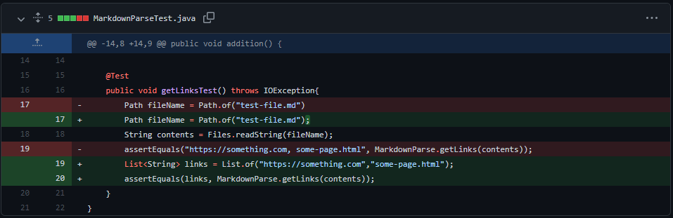
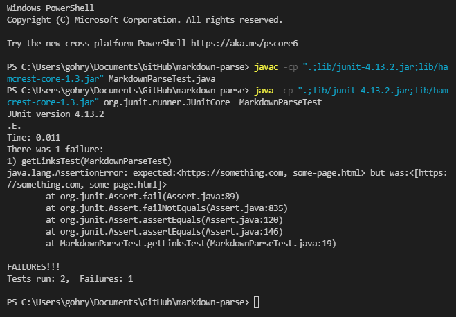

# Week 4 Lab Report 2
## This lab report includes 3 code changes completed in lab 3 and 4.

[Link to index page](https://rygoh1.github.io/cse15l-lab-reports/index.html)

### Code change 1

* This is a screenshot of the commit to Github. We were not able to complete the full code before class ended, but this was the beginning of out of new implementation of MarkdownParse.
* The original code is the code below the green highlighted added code.


* This is a link to the test file that caused an error. The file contains a link to a hypothetical website www.broken().com


[Link to file](https://github.com/Rygoh1/markdown-parse/blob/main/breakfile.md)


* This is a screenshot of the symptom that the original MarkdownParse code provided with the lab had an error. The terminal output indicates that there is an infinite loop somewhere in the code.


* The failure-inducing input in this case was the hypothetical link [www.broken().com](www.broken().com). 

* The error message that is outputted in the terminal as a result of the failure-inducing input is the symptom, which tells us that there is a bug with the code. 

* The bug is in the way the original code is written. The original code searches for the specific characters ```"["```,```"]"```,```"("``` and ```")"``` in this specific order. Since the input link has more of these characters than expected, the function is thrown into an infinite loop.


### Code change 2

* This is another screenshot of a different commit to Github. This was our first correction to writing a tester method to test the MarkdownParse ```getLinks()``` method.




* The test file that we were testing was the original test file. This file was the initial file that was provided.


[Link to file](https://github.com/Rygoh1/markdown-parse/blob/main/test-file.md)


* This is a screenshot of the symptom that the test method is not working. The tester method had an error while compiling.



* In this case, the input was not the direct cause of the error. The file used should be working with the tester method, it was an error within the method itself.

* The symptom was the output error message when the code could not compile, highlighting the bug with the method.

* The bug was within the code in which we left the line of code ```Path fileName = Path.of("test-file.md");``` which was required in order to use the ```Files.readString()``` method. 


### Code change 3

* This is another screenshot of a commit to Github. This was an error that occured after the code change 2.




* The test file that we were testing is the same as code change 2.


[Link to file](https://github.com/Rygoh1/markdown-parse/blob/main/test-file.md)


* This is a screenshot of the symptom that the test method is not working properly. The ```assertEquals()``` method was indicating that the actual result was not matching the expected one.



* In this case, the input test file was the same test file as code change 2, but similarly to in that case, the test input was not the direct cause of the issue.

* The symptom was again the error message that stated that the actual output of ```getLinks()``` did not match the expected output.

* The bug in the code was actually in the expected parameter that we set for ```assertEquals()```. The output of ```getLinks()``` is a List but the parameter we used was a string.