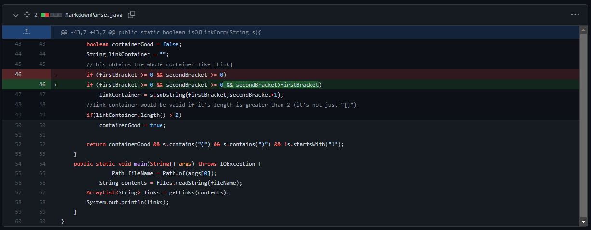
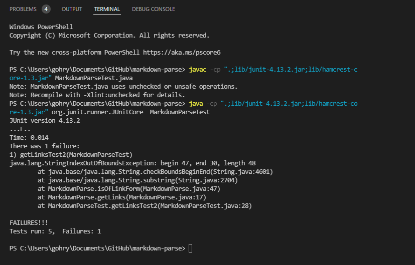
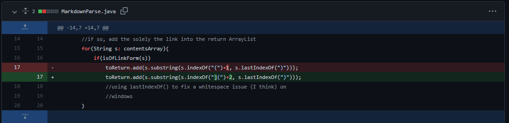
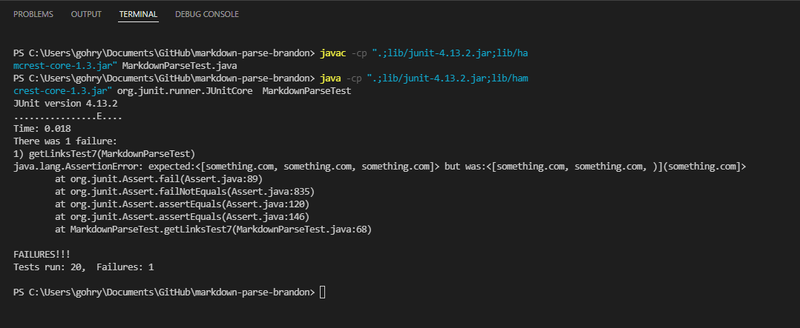

# Week 4 Lab Report 2
## This lab report includes 3 code changes completed in lab 3 and 4.

[Link to index page](https://rygoh1.github.io/cse15l-lab-reports/index.html)

### Code change 1

* This is a screenshot of the commit to Github. We were not able to complete the full code before class ended, but this was the beginning of out of new implementation of MarkdownParse.
* The original code is the code below the green highlighted added code.


* This is a link to the test file that caused an error. The file contains a link to a hypothetical website www.broken().com


[Link to file](https://github.com/Rygoh1/markdown-parse/blob/main/breakfile.md)


* This is a screenshot of the symptom that the original MarkdownParse code provided with the lab had an error. The terminal output indicates that there is an infinite loop somewhere in the code.


* The failure-inducing input in this case was the hypothetical link [www.broken().com](www.broken().com). 

* The error message that is outputted in the terminal as a result of the failure-inducing input is the symptom, which tells us that there is a bug with the code. 

* The bug is in the way the original code is written. The original code searches for the specific characters ```"["```,```"]"```,```"("``` and ```")"``` in this specific order. Since the input link has more of these characters than expected, the function is thrown into an infinite loop.


### Code change 2

* This is another screenshot of a different commit to Github. It shows an added condition to the if statement to check if ``[`` is in front of ``]``.




* This is a link to the test file that caused an error. The call to ``getLinks()`` should return ``https://www.parenthesis().com``

[Link to file](https://github.com/Rygoh1/markdown-parse/blob/main/test-file3.md)


* This is a screenshot of the symptom that the ``getLinks()`` method is not working. The tester method shows that ``getLinks()`` returns an error when called on this markdown file.



* The failure-inducing input in this case was not the line with the link, but it was actually the non-link line ``This is just a paragraph but ] it has brackets [``.

* The error message that is outputted in the terminal showing the ``IndexOutOfBoundsException`` caused by the failure-inducing input is the symptom, which tells us that there is a bug with the code. 

* The bug in the code was in the if statement. The code checks that the ``[]`` contains at least one symbol in order to be a valid link, but the old code did not check if the ``[`` is actually infront of a ``]`` causing the ``IndexOutOfBoundsException`` when trying to make a substring. 


### Code change 3

* This is another screenshot of a commit to Github. It shows a small change to the code from ``(s.indexOf("(")+1, s.lastIndexOf(")")`` to ``(s.indexOf("](")+2, s.lastIndexOf(")")``.




* This is a link to the test file that caused an error. The call to ``getLinks()`` should return ``something.com, something.com, something.com``


[Link to file](https://github.com/bimai25/markdown-parse/blob/main/test-file7.md)


* This is a screenshot of the symptom that the ``getLinks()`` method is not working. The tester method shows that ``getLinks()`` does not return what we expected.



* The failure-inducing input in this case was third line ``[()](something.com)``.

* The error message that is outputted in the terminal showing the failed ``assertEquals()`` test caused by the failure-inducing input is the symptom, which tells us that there is a bug with the code.

* The bug in the code is a small difference in which the toReturn returned a substring using the first ``(`` and last ``)``, however, the parenthesis in the name of the link in the failure-inducing input causes the substring to be ``)](something.com)`` instead of just ``something.com``.