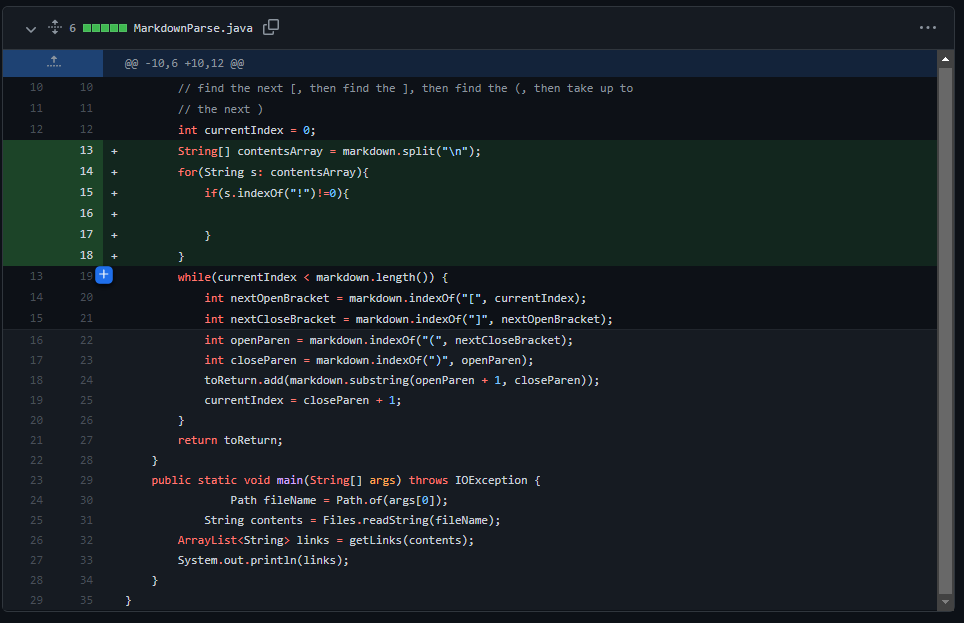
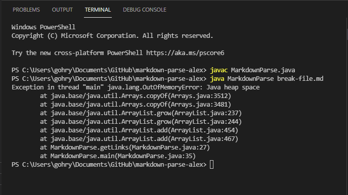

# Week 4 Lab Report 2
## This lab report includes 3 code changes completed in lab 3 and 4.

### Code change 1

* This is a screenshot of the commit to Github. We were not able to complete the full code before class ended, but this was the beginning of out of new implementation of MarkdownParse.
* The original code is the code below the green highlighted added code.



* This is a link to the test file that caused an error. The file contains a link to a hypothetical website www.broken().com

[link](https://github.com/Rygoh1/markdown-parse/blob/main/breakfile.md)

* This is a screenshot of the symptom that the original MarkdownParse code provided with the lab had an error. 



* The failure-inducing input in this case was the hypothetical link [www.broken().com](www.broken().com). 

* The error message that is outputted in the terminal as a result of the failure-inducing input is the symptom, which tells us that there is a bug with the code. 

* The bug is in the way the original code is written. The original code searches for the specific characters ```"["```,```"]"```,```"("``` and ```")"``` in this specific order. Since the input link has more of these characters than expected, the function is thrown into an infinite loop.