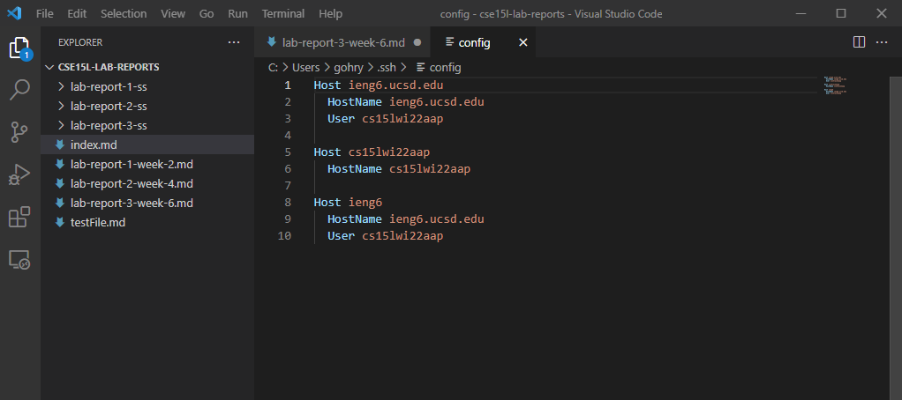
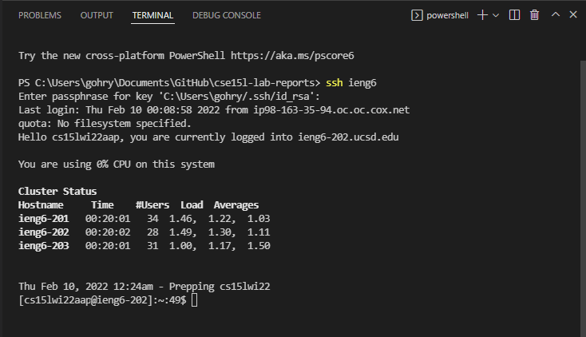
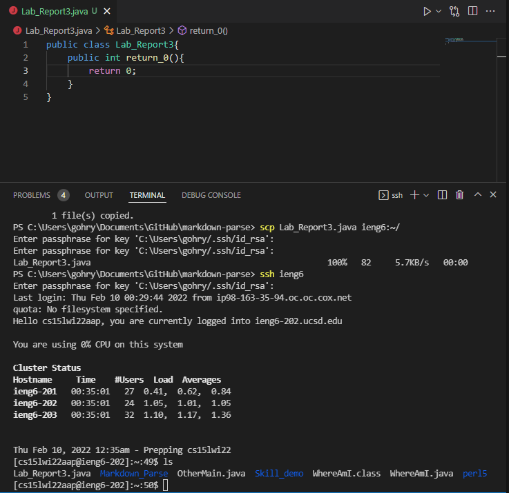
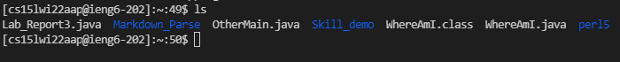

# Week 6 Lab Report 3
## This lab report is on Group Choice 1 from week 5 lab

[index page](index.html)

### Streamlining ``ssh`` Configuration

* This is a screenshot of my ``.ssh/config`` file. I used VSCode to edit the file, but on windows the notepad program also works.

* I found the config file by opening file explorer going to OS (C:) > Users > my username > .ssh > config

* This is a screenshot of the output after running ``ssh ieng6`` in the terminal of VSCode.

* The name that you use after typing ``ssh`` can be changed in the ssh config file by changing the Host and copying the HostName and User on a new line.

* This is a screenshot of the output after running ``scp FILE_NAME ieng6:~/`` in the terminal of VSCode. It is important to add the ``:~/`` after the HostName or else ``scp`` will copy the file into a new file with the same name as the HostName.

* After the ``scp``, I run ``ssh`` and ``ls`` to show that the file was properly copied to the remote server.

* As you can see in the output of running ``ls``, the Lab_Report3.java file that I copied is in the remote server.

