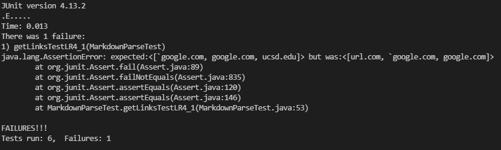
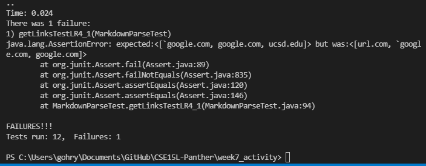
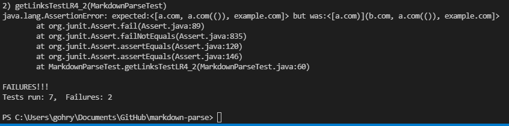
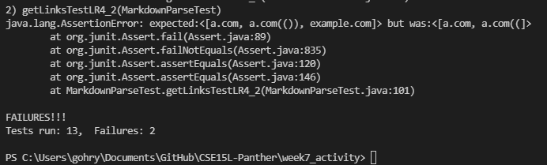
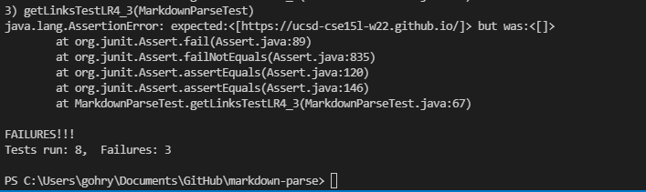
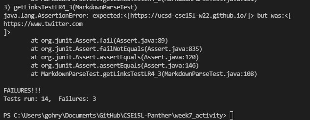

# Week 8 Lab Report 4
## This lab report tests the code of our group and the group that we reviewed Week 7

* In this report I will be using [the CommonMark demo site](https://spec.commonmark.org/dingus/) as a reference for the expected output of each test snippet. 

* Links to [My markdown repository](https://github.com/Rygoh1/markdown-parse) and [Annie's repository(Panther)](https://github.com/AnniePhan02/CSE15L-Panther)

### Snippet 1

```
`[a link`](url.com)

[another link](`google.com)`

[`cod[e`](google.com)

[`code]`](ucsd.edu)
```

* Expected output Arraylist should include ```"`google.com"```, ```"google.com"```, and ```"ucsd.edu"``` strings. [Reference](https://spec.commonmark.org/dingus/)

* For our implementation (Goldendoodles), the test did not pass. Below is the failing JUnit output.



* For the implementation we reviewed(Panthers), the test also did not pass. Below is the failing JUnit output.



* For our implementation, I do not believe that there is a small code change that would make our program work. I think we would have to add a check if there is a ```"`"``` character between the `[` and `]`. If there is, we would have to check any other ```"`"``` character to determine their pairing. Only if the ```"`"``` inside the square brackets is not in a pair with a another ```"`"``` outside of the two square brackets will the link be added to the return arraylist.

### Snippet 2

```
[a [nested link](a.com)](b.com)

[a nested parenthesized url](a.com(()))

[some escaped \[ brackets \]](example.com)
```

* Expected output Arraylist should include ```"a.com"```, ```"a.com(())"```, and ```"example.com"``` strings. [Reference](https://spec.commonmark.org/dingus/)

* For our implementation (Goldendoodles), the test did not pass. Below is the failing JUnit output.



* For the implementation we reviewed(Panthers), the test also did not pass. Below is the failing JUnit output.



* For our implementation, I do believe a small code change can be done to fix the program. The first link was the link that caused issues, and I think that we would simply have to determine where the `)` that is paired with `](` by using the while loop that was discussed in this weeks Monday lecture. We would have to add the substring up to the next `)` that is not paired with an a new `(` to the toReturn Arraylist.

### Snippet 3

```
[this title text is really long and takes up more than 
one line

and has some line breaks](
    https://www.twitter.com
)

[this title text is really long and takes up more than 
one line](
    https://ucsd-cse15l-w22.github.io/
)


[this link doesn't have a closing parenthesis](github.com

And there's still some more text after that.

[this link doesn't have a closing parenthesis for a while](https://cse.ucsd.edu/


)

And then there's more text
```

* Expected output Arraylist should only include ```"https://ucsd-cse15l-w22.github.io/"``` string. [Reference](https://spec.commonmark.org/dingus/)

* For our implementation (Goldendoodles), the test did not pass. Below is the failing JUnit output.



* For the implementation we reviewed(Panthers), the test also did not pass. Below is the failing JUnit output.



* For our implementation, I do not believe that there is a small code change that would make our program work. This is because our code is made with the assumption that links are all on one line so our getLinks method separates the markdown arg String by `\n` breaks. In order to make our code work for snippet 3, we would have to rewrite most of our code to not rely on separating the markdown string by lines of the input markdown file.